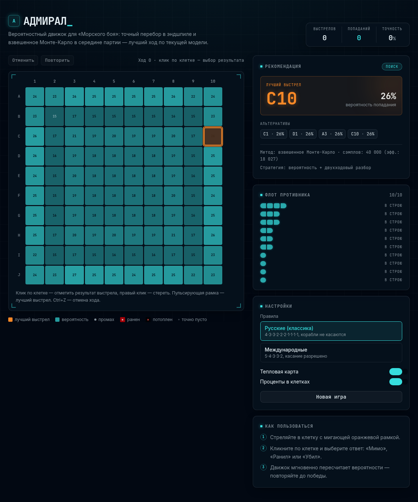
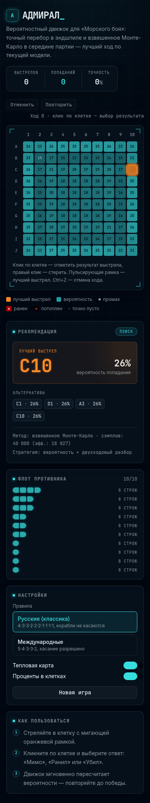

# Admiral — Battleship Mathematical Scoring Model

[](https://github.com/HumSaw/battleship-math-model/actions/workflows/ci.yml)
[](LICENSE)
[](https://nextjs.org/)

A browser-based Battleship advisor that scores every legal target from the current board state. The engine combines constrained fleet enumeration, weighted Sequential Importance Sampling, two-ply lookahead, and bounded expectimax for small endgames.

> This is a probabilistic decision-support tool, not a guarantee of winning. Its recommendation is optimal only with respect to the model, observations, rule set, and available compute budget.

## Live demo

**Production:** [admiral-weld.vercel.app](https://admiral-weld.vercel.app)

## Screenshots

| Desktop | Mobile |
| --- | --- |
|  |  |

## Features

- Russian classic fleet rules and international Hasbro-style rules
- 10×10 probability heatmap with Latin row coordinates
- Exact legal-placement enumeration when the state space is small
- Weighted Monte Carlo via Sequential Importance Sampling for larger positions
- Two-ply conditional lookahead for close candidates
- Bounded expectimax in tractable endgames
- Hunt, target, victory, and inconsistency state detection
- Web Worker analysis with stale-request cancellation
- Undo history, explicit sunk-ship tracking, and keyboard shortcuts
- Deterministic engine tests, coverage thresholds, lint, typecheck, and CI

## How it works

Given observations $$O$$ and a legal fleet configuration $$C$$, the engine estimates each unknown cell’s posterior occupancy:

$$P(\text{ship at } x \mid O) = \frac{\sum_C w(C)\,\mathbf{1}[x \in C]}{\sum_C w(C)}$$

For large state spaces, configurations are sampled sequentially and weighted by the number of legal choices available at each placement step. For close candidates, the policy evaluates the expected quality of the following shot:

$$Q(x) = q_x\left(1 + \max_y P(y \mid x\text{ hit})\right) + (1-q_x)\max_y P(y \mid x\text{ miss})$$

Manual checkerboard bonuses are intentionally not used: fleet geometry is already represented in the posterior, and an extra heuristic can select a strictly lower-probability target.

See [Algorithm Notes](docs/ALGORITHM.md) and [Architecture](docs/ARCHITECTURE.md) for implementation details and limitations.

## Quick start

Requirements: Node.js 22+ and pnpm 10+.

```bash
git clone https://github.com/HumSaw/battleship-math-model.git
cd battleship-math-model
pnpm install
pnpm dev
```

Open `http://localhost:3000`.

## Quality checks

```bash
pnpm typecheck
pnpm lint
pnpm test
pnpm test:coverage
pnpm build
```

Current verified baseline: **11 passing tests**, **60.32% line coverage**, **58.87% statement coverage**, **52.8% branch coverage**, and **67.5% function coverage** for the core engine.

## Reproducible simulator

The repository includes a seeded, multi-worker simulator against uniformly generated legal fleets. Build the script, then run it with explicit parameters:

```bash
pnpm simulate -- \\
  --games 1000 --workers 4 --rules russian \\
  --samples 1200 --budget 30 --seed 42
```

Simulation results are sensitive to sample count, per-move budget, CPU speed, fleet prior, and rule set. Do not compare numbers unless all parameters and the commit SHA match.

## Project structure

```text
app/                         Next.js App Router entry points and theme
components/                  Board, advisor, recommendation, fleet UI
hooks/use-analysis.ts        Cancellable Web Worker bridge
lib/battleship-engine.ts     Core inference and policy engine
lib/engine.worker.ts         High-budget browser worker
scripts/simulate.ts          Seeded multi-worker benchmark
lib/*.test.ts                Vitest engine tests
docs/                        Algorithm, architecture, and release assets
.github/                     CI and community templates
```

## Contributing

Bug reports and focused pull requests are welcome. Read [CONTRIBUTING.md](CONTRIBUTING.md), include a minimal board state for engine bugs, and add regression tests for behavior changes.

## License

Released under the [MIT License](LICENSE).
