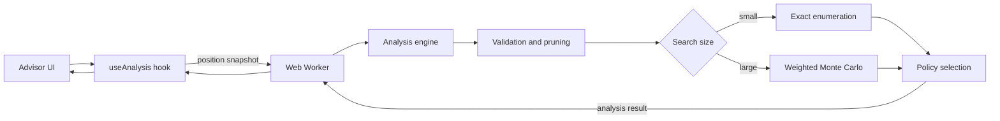

# Architecture

## Runtime flow

## UI layer

`components/advisor.tsx` owns immutable position history, rule switching, popover state, and explicit sunk-ship records. `components/board.tsx` renders the probability grid and exposes semantic controls for every cell. Recommendation and fleet components are presentation-only.

## Worker boundary

`hooks/use-analysis.ts` starts a module worker for each position snapshot. When observations change, the previous worker is terminated so expensive synchronous analysis cannot queue stale results. A lower-budget synchronous fallback is scheduled if worker startup or execution fails.

## Engine

`lib/battleship-engine.ts` is framework-independent. Its public API accepts plain arrays and returns a serializable `Analysis`. The implementation contains geometry helpers, input validation, legal-placement caches, exact enumeration, weighted sampling, fallback density scoring, lookahead, and expectimax.

## State integrity

Sunk ships are stored as explicit cell arrays in UI history. This is required for international rules, where legal touching ships could otherwise appear as one flood-filled component. Switching rule sets resets the board because fleet definitions and contact constraints are not interchangeable.

## Performance safeguards

- Analysis runs off the main thread in normal operation.
- Monte Carlo is bounded by accepted samples, attempts, and wall-clock time.
- Exact enumeration is bounded by an estimated tree limit.
- Expectimax is bounded by configuration count, node count, and wall-clock time.
- Only a capped sample subset is retained for lookahead.

## Verification

Vitest covers geometry, clustering, state validation, recommendation legality, target mode, sunk-ship constraints, completion, and deterministic seeded sampling. GitHub Actions runs typecheck, ESLint, coverage thresholds, and a production Next.js build on every pull request and push to `main`.
